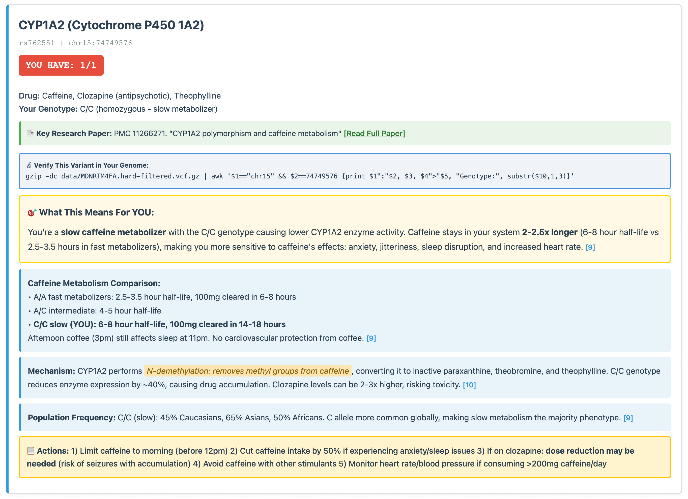

# Genome Analysis Tool

Analyze VCF files from whole genome sequencing for clinically relevant variants: pharmacogenomics, disease risk, and traits. All interpretations verified against peer-reviewed research.

> **Built with [Claude Code](https://claude.com/claude-code):** This entire repository—analysis scripts, variant database with 70+ verified genetic markers, comprehensive report generation system, documentation, and project structure—was created using Claude Code.

## Structure

```
.
├── rsid_genome_analyzer_verified.py  # Main analysis script
├── detect_new_variants.py             # Incremental update helper
├── data/                              # Input: VCF files
├── analyses/                          # Output: Generated reports
├── CLAUDE.md                          # Instructions for Claude Code
└── README.md                          # This file
```

**data/** = Input (raw genome files), **analyses/** = Output (regenerable reports). Both gitignored for privacy.

## Quick Start

```bash
# 1. Place VCF file
cp ~/my-genome.vcf.gz data/

# 2. Run analysis
python rsid_genome_analyzer_verified.py

# 3. Create comprehensive report with Claude
claude
> "Create comprehensive report from analyses/GENOME_ANALYSIS.html"
```

**Requirements:** VCF format with rsID annotations, 30x WGS recommended, GRCh37/hg19 or GRCh38/hg38.

**Output:**
- `analyses/GENOME_ANALYSIS.html` - Basic report
- `analyses/GENOME_ANALYSIS_COMPREHENSIVE.html` - Detailed report with explanations, citations, comparisons

## Example Output

The comprehensive report provides detailed explanations, quantitative comparisons, and research citations for each variant:



*Each variant includes inline explanations, genotype comparisons with specific numbers, mechanism details, population frequencies, and actionable recommendations—all backed by peer-reviewed research.*

## What Gets Analyzed

**Pharmacogenomics (25+):** CYP enzymes (codeine, tamoxifen, antidepressants), TPMT/DPYD (chemo toxicity), VKORC1 (warfarin), HLA-B*15:02 (carbamazepine), NAT2 (isoniazid)

**Disease Risk (20+):** APOE ε4 (Alzheimer's), Factor V Leiden (clotting), MTHFR/HFE (folate/iron), TCF7L2/FTO (diabetes/obesity)

**Traits (30+):** Eye color, hair texture, skin pigmentation, taste perception, athletic performance, caffeine/alcohol metabolism, lactose tolerance, circadian rhythm

## Incremental Updates

When adding variants to the database:

```bash
# 1. Edit rsid_genome_analyzer_verified.py (add variants with citations)
# 2. Rerun analysis
python rsid_genome_analyzer_verified.py

# 3. Detect new variants
python detect_new_variants.py

# 4. Update incrementally
claude
> "Incrementally update comprehensive report"
```

**Benefit:** Process only new variants instead of regenerating everything. 4 new variants = 2-5 minutes vs 15 minutes.

## Command Line Options

```bash
# rsid_genome_analyzer_verified.py
python rsid_genome_analyzer_verified.py                    # Auto-detect VCF
python rsid_genome_analyzer_verified.py --vcf path.vcf.gz  # Specify VCF
python rsid_genome_analyzer_verified.py --output-dir results/
python rsid_genome_analyzer_verified.py --help

# detect_new_variants.py
python detect_new_variants.py                # Default analyses/ directory
python detect_new_variants.py --dir results/
python detect_new_variants.py --help
```

## Requirements

Python standard library only (gzip, json, os, time, datetime, collections, glob, argparse). For comprehensive reports: Claude Code (see CLAUDE.md).

## Adding Variants

Edit `rsid_genome_analyzer_verified.py`, add entries to `MassiveVariantDatabase` class with citations:

```python
# rs1234567 (GENE_NAME) - VERIFIED
# Brief description
# Sources:
# - Database/Journal (Year): "Title" URL
'rs1234567': {
    'gene': 'GENE_NAME',
    'condition': 'Condition/Drug Name',
    'category': 'pharmacogenomic',  # or clinical, traits
    'ref_allele': 'A',
    'alt_allele': 'G',
    'if_het': 'Heterozygous interpretation',
    'if_hom_alt': 'Homozygous alt interpretation',
    'importance': 'HIGH'  # or CRITICAL, MEDIUM
},
```

See CLAUDE.md "Adding New Variants to the Database" for complete format.

## Disclaimers

**Medical:** Educational/research purposes only. Not medical advice or diagnostic testing. Consult healthcare providers for medical decisions.

**Technical:** Results depend on VCF quality. Curated database, not exhaustive. Interpretations may change with new research.

**Privacy:** Analysis runs locally. No data uploaded. Keep VCF and reports secure (sensitive genetic data).

## Resources

**Databases:** [PharmGKB](https://www.pharmgkb.org/) | [CPIC](https://cpicpgx.org/) | [ClinVar](https://www.ncbi.nlm.nih.gov/clinvar/) | [dbSNP](https://www.ncbi.nlm.nih.gov/snp/) | [GWAS Catalog](https://www.ebi.ac.uk/gwas/)

**Sequencing:** [Nebula Genomics](https://nebula.org/) | [Dante Labs](https://www.dantelabs.com/) | [Sequencing.com](https://sequencing.com/) | [Full Genomes](https://www.fullgenomes.com/)

**Documentation:** See CLAUDE.md for technical details, citation requirements, and comprehensive report format specifications.
